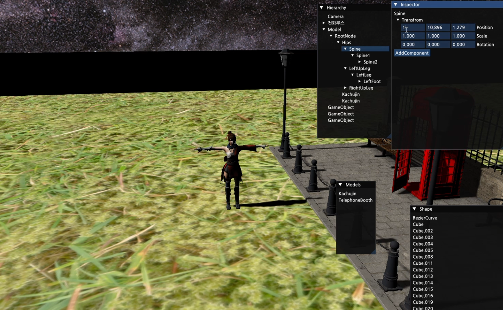
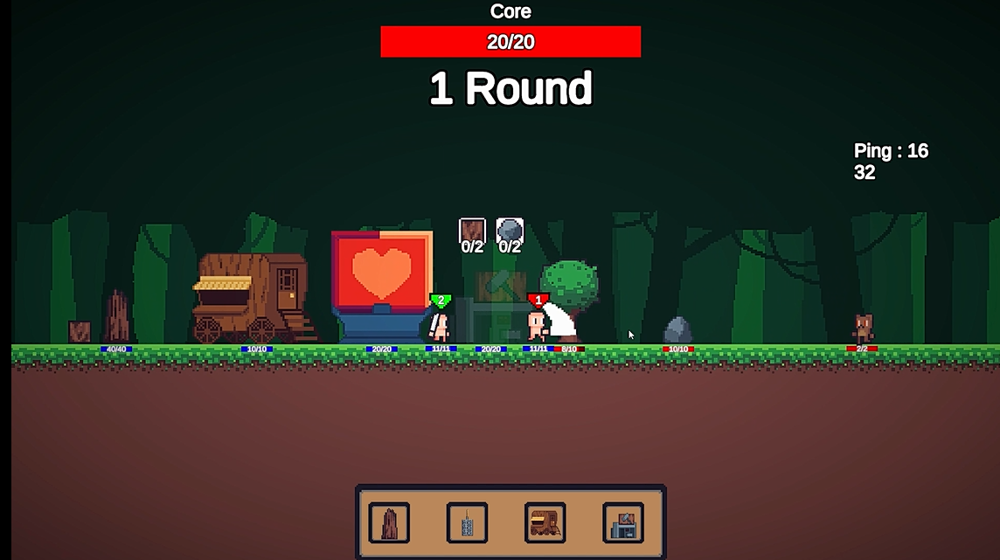

<h1>오선호 포트폴리오</h2>
<line>
안녕하세요! 게임을 좋아해서 재밌는 게임을 만드는 것을 목표로하는 오선호라고 합니다. 
재밌는 게임을 만드는 것을 목표로 배우며 활용하고 있습니다!
<line>
<h2>기술스택</h2>
C++, C#, Unity, DirectX
<Line>
<h2>경험 기술</h2>
UnealEngine, Mysql
<Line>
  
<h2>프로젝트</h3>
<line>
<h3>개인프로젝트</h3>
   
<h4>1.2D 런앤 건 게임</h4>

  <blockquote>
    
    이미지 클릭 시 플레이영상으로 이어집니다.
    <blockquote>
    진행 기간 : 2023년 1월 16일 ~ 2023년 4월 25일  
    사용 기술 : 유니티, C#  
    중점 사항 : 유니티 에디터를 이용한 자동화  
    진행 역할 : 이미지제작을 제외한 전반적인 부분  
    

        
카드 에디터 코드

        

            
            
          

          

            
            
          

            자동화 코드를 사용하여 하단의 스크립트를 새로 만들어 카드를 추가해해줍니다.
          

            
            
          

    

    

      
맵 에디터 코드

          

            
            
          

            에디터 코드를 작성해서 에디터를 수정하기 편하게 만들어주었습니다.
          

            
          

    

    </blockquote>
  </blockquote>
  
  
<h4>2. DirectX 게임 에디터</h4>

  <blockquote>
  
        이미지 클릭 시 플레이영상으로 이어집니다.
    <blockquote>
      진행 기간 :2024년 7월 15일 ~ 2024년 8월 18일  
      사용 기술 : C++, DirectX, PhysX  
      중점 사항 : DirectX를 활용한 에디터, PhysX를 이용한 물리작용 구현 
      진행 역할 : 혼자서 진행  
    </blockquote>
  </blockquote>

<h4>3. 던전시커</h4>

<blockquote>
진행 기간 :2024년 8월 21일 ~  
진행중~  

</blockquote>

<h3>대학과제</h3>

<h4>1.대학교 게임프로그래밍 과제</h4>

<blockquote>

이미지 클릭 시 플레이영상으로 이어집니다.
  <blockquote>
      진행 기간 :2023년 5월 3일 ~ 2023년 6월 13일  
      사용 기술 : C#, 유니티  
      중점 사항 : 다크소울류 전투 비슷하게 구현 
      진행 역할 : 보스의 AI패턴 구현  
    </blockquote>
</blockquote>

<h4>2.대학교 졸업작품</h4>

<blockquote>

이미지 클릭 시 플레이영상으로 이어집니다.
   <blockquote>
    진행 기간 :2023년 8월 26일 ~ 2023년 10월 31일 
     사용 기술 : C#,유니티  
      중점 사항 : C#으로 서버를 구현 
      진행 역할 : 혼자서 진행  
    </blockquote>
</blockquote>
